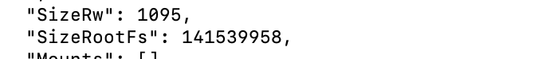
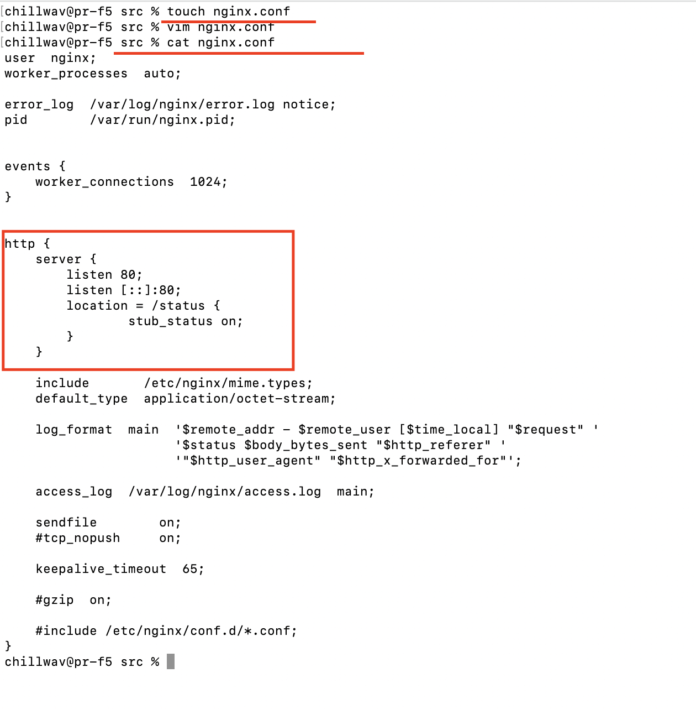
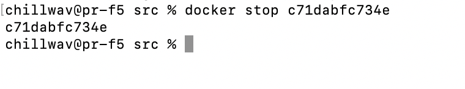
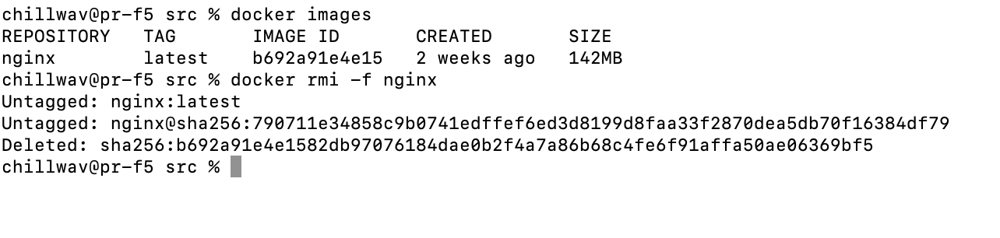

## Part 1. Готовый докер
###### Взял с официальный докер образ nginx и скачал его при помощи [ docker pull ] и проверил наличие докер образа с помощью команды [ docker images]

###### Запустил образ докер в фоновом режиме с помощью команды [ docker run -d ] и проверил, что образ запустился через [ docker ps ]

###### Посмотрел информацию о контейнере через [ docker inspect ]

###### Размер контейнера = 1095

###### Проверил эту информацию через [docker ps -s]
.png)
###### Список замапленных портов:

###### Ip address:

###### Остановил докер контейнер с помощью команды [ docker stop ]
###### Также проверил, что докер остановился через [ docker ps ]

###### Запустил докер с замапленными портами 80 и 443 на локальную машину через команду run

###### Проверил, что в браузере по адресу localhost:80 доступна стартовая страница nginx

###### Перезапустил докер контейнер через [ docker restart ] и проверил, что он  

## Part 2. Операции с контейнером

###### Прочитал конфигурационный файл nginx.conf внутри докер образа через команду exec

###### Создал на локальной машине файл nginx.conf и настроил в нем по пути /status отдачу страницы статуса сервера nginx

###### Скопировал созданный файл nginx.conf внутрь докер образа через команду docker cp и перезапустить nginx внутри докер образа через команду exec

###### Проверил, что по адресу localhost:80/status отдается страничка со статусом сервера nginx

###### Экспортировать контейнер в файл container.tar через команду export

###### Остановил контейнер

###### Удалил образ через docker rmi -f [image_id|repository], не удаляя перед этим контейнеры

###### Удалил остановленный контейнер

###### Импортировал контейнер обратно через команду import, запустил импортированный контейнер и проверил что по адресу localhost:80/status отдается страничка со статусом сервера nginx

## Part 3. Мини веб-сервер
###### Написал мини сервер на C и FastCgi, который будет возвращать простейшую страничку с надписью Hello World!

###### Обновил пакеты в контейнере и подгрузил библиотеку fcgi

###### Запустил написанный мини сервер через spawn-fcgi на порту 8080

###### Написал свой nginx.conf, который будет проксировать все запросы с 81 порта на 127.0.0.1:8080

###### Проверил, что в браузере по localhost:81 отдается написанная вами страничка

## Part 4. Свой докер

###### Написал свой докеб образ, который соотвествует следующим пунктам:
1) собирает исходники мини сервера на FastCgi из Части 3
2) запускает его на 8080 порту
3) копирует внутрь образа написанный ./nginx/nginx.conf
4) запускает nginx.
###### Cобрал написанный докер образ через docker build при этом указав имя и тег, а также проверил через docker images, что все собралось корректно

###### Запустил собранный докер образ с маппингом 81 порта на 80 на локальной машине и маппингом папки ./nginx внутрь контейнера по адресу, где лежат конфигурационные файлы nginx'а

###### Дописал в ./nginx/nginx.conf проксирование странички /status, по которой надо отдавать статус сервера nginx

###### Перезапустил докер образ и проверил, что теперь по localhost:80/status отдается страничка со статусом nginx

## Part 5. Dockle

###### Просканировал образ из предыдущего задания через dockle [image_id|repository].

###### Исправил образ так, чтобы при проверке через dockle не было ошибок и предупреждений

###### Проверил корректность образа запустив докер контейнер 

## Part 6. Базовый Docker Compose

###### Написал файл docker-compose.yml, с помощью которого:
1) Поднял докер контейнер из Части 5 (он должен работать в локальной сети, т.е. не нужно использовать инструкцию EXPOSE и мапить порты на локальную машину)
2) Поднять докер контейнер с nginx, который будет проксировать все запросы с 8080 порта на 81 порт первого контейнера

###### Собрал и запустил проект с помощью команд docker-compose build и docker-compose up

###### Проверил, что в браузере по localhost:80 отдается написанная страничка, как и ранее
